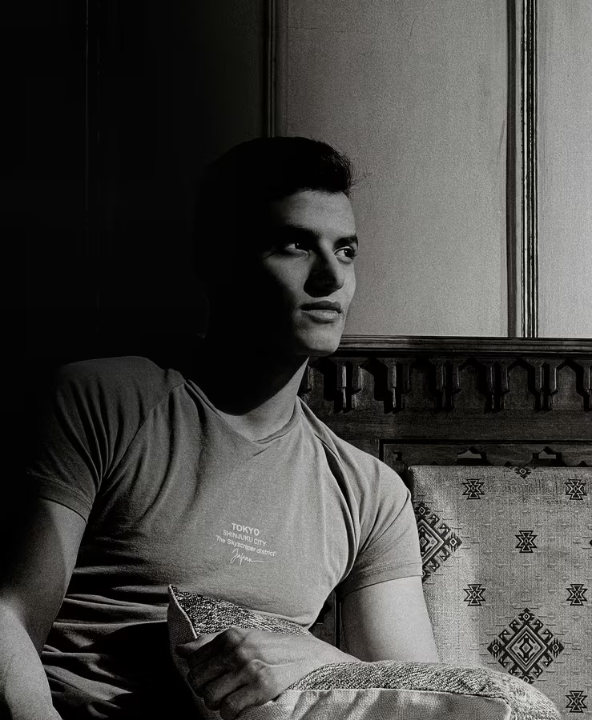

# Modern Portfolio Website

<div align="center">

<!--  -->

A modern, minimalist single-page portfolio website built with Next.js and Tailwind CSS.

[](https://nextjs.org/)
[](https://www.typescriptlang.org/)
[](https://tailwindcss.com/)

</div>

## 🌟 Features

- 🎨 Modern and minimalist design
- 📱 Fully responsive layout
- ⚡ Built with Next.js for optimal performance
- 🎯 Smooth scrolling navigation
- 🖼️ Project showcase section
- 👥 Testimonials section
- ❓ FAQ section
- 📝 Contact form
- 🌙 Dark mode support (coming soon)

## 🚀 Tech Stack

- **Framework:** Next.js 14
- **Language:** TypeScript
- **Styling:** Tailwind CSS
- **Animations:** Motion
- **Icons:** Custom SVG icons
- **Images:** Optimized with Next.js Image component

## 🛠️ Getting Started

1. **Clone the repository**
   ```bash
   git clone https://github.com/chihtengma/Portfolio_2025.git
   ```

2. **Install dependencies**
   ```bash
   cd Portfolio_2025
   npm install
   ```

3. **Run the development server**
   ```bash
   npm run dev
   ```

4. **Open [http://localhost:3000](http://localhost:3000) in your browser**

## 📁 Project Structure

```
Portfolio_2025/
├── src/
│   ├── app/              # Next.js app directory
│   ├── components/       # Reusable components
│   ├── sections/         # Page sections
│   ├── assets/          # Static assets
│   │   ├── icons/       # SVG icons
│   │   └── images/      # Image assets
│   └── hooks/           # Custom React hooks
├── public/              # Public assets
└── ...config files
```

## 🎨 Customization

1. Update personal information in `src/app/page.tsx`
2. Modify the color scheme in `tailwind.config.ts`
3. Add your own images to `src/assets/images/`
4. Customize the sections in `src/sections/`

## 📝 License

This project is licensed under the MIT License - see the [LICENSE](LICENSE) file for details.

## 🙏 Acknowledgments

- Inspired by [Frontend Tribe](https://www.youtube.com/@frontendtribe) YouTube channel
- Design inspiration from modern portfolio trends
- Icons from custom SVG collection

---

<div align="center">
Made with ❤️ by ChihTeng Ma
</div>
